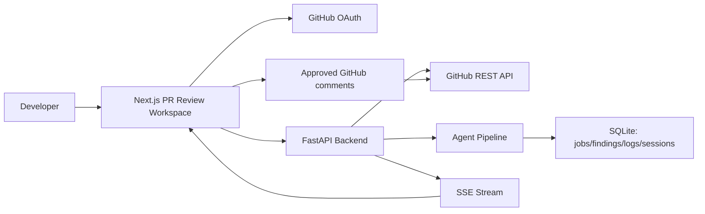

# Agentic Code Review Assistant

**AI-powered Pull Request Review Assistant for Engineering Teams.**

Developers spend hours reviewing pull requests manually, and important bugs, security issues, performance problems, and code smells still slip through. Agentic Code Review Assistant is an MVP/prototype that connects to GitHub, reviews pull requests in real time with a modular AI-agent pipeline, streams agent activity, generates actionable findings, and lets humans approve comments before posting them back to GitHub.

This is not a generic GitHub dashboard. The product is focused on one workflow: helping engineering teams review pull requests faster and more reliably.

## Features

- GitHub OAuth login for reviewer workspace access
- Optional manual token fallback for local development/demo mode
- Repository list from the authenticated GitHub account
- Open pull request list per repository
- AI Pull Request Review Workspace centered on Monaco diff viewing
- Real-time SSE agent timeline and activity toasts
- React Flow agent pipeline graph
- Security, bug, performance, and code-smell findings
- Severity and agent filtering
- Approve/reject review findings
- Batch approve safe findings
- Batch post approved comments to GitHub
- Review history persisted locally with `/reviews/[jobId]` deep links
- Light/dark/system theme support via `next-themes`

## Architecture



## Tech Stack

Backend:
- FastAPI
- Python
- httpx
- SQLite
- GitHub REST API
- OAuth App authentication
- encrypted server-side token storage
- Server-Sent Events

Frontend:
- Next.js App Router
- TypeScript
- Tailwind CSS
- Monaco Editor
- React Flow
- next-themes
- pnpm

## Folder Structure

```text
backend/
  app/
    api/auth.py
    api/github.py
    api/review.py
    agents/
    services/
    models/
frontend/
  app/
    dashboard/
    repositories/
    pull-requests/
    reviews/
  components/
    auth/
    dashboard/
    repositories/
    pullRequests/
    review/
    agents/
    layout/
  hooks/
  lib/
```

## Clerk GitHub OAuth Setup

The recommended auth path uses Clerk with GitHub as a social connection.

1. Create a Clerk application.
2. In Clerk, enable the GitHub social connection.
3. Follow Clerk's GitHub provider setup to create/configure the GitHub OAuth App.
4. Add these values to `frontend/.env.local`:

```text
NEXT_PUBLIC_CLERK_PUBLISHABLE_KEY=pk_...
CLERK_SECRET_KEY=sk_...
NEXT_PUBLIC_API_BASE_URL=http://localhost:8000
```

5. In Clerk, ensure GitHub OAuth token access is enabled for the GitHub connection so the app can retrieve the user's GitHub token server-side.

The frontend retrieves the GitHub OAuth token through a Next.js server route (`/api/github-token`) and sends it in-memory to the existing FastAPI review APIs. Tokens are not stored in browser localStorage.

## Legacy Backend OAuth Setup

The backend still includes a simple GitHub OAuth implementation for development, but Clerk is the preferred product path. To use the backend OAuth fallback directly:

1. Go to GitHub `Settings` -> `Developer settings` -> `OAuth Apps`.
2. Create a new OAuth App.
3. Set Homepage URL:

```text
http://localhost:3000
```

4. Set Authorization callback URL:

```text
http://localhost:8000/auth/github/callback
```

5. Copy the Client ID and Client Secret into `.env`.

OAuth scopes requested by the app:

```text
repo read:user user:email
```

## Environment Variables

Copy `.env.example` to `.env` at the project root.

```text
DATABASE_PATH=/data/reviews.db
CORS_ORIGINS=http://localhost:3000,http://127.0.0.1:3000
BACKEND_PORT=8000
FRONTEND_URL=http://localhost:3000
DEMO_MODE=false

GITHUB_OAUTH_CLIENT_ID=
GITHUB_OAUTH_CLIENT_SECRET=
GITHUB_OAUTH_CALLBACK_URL=http://localhost:8000/auth/github/callback
SESSION_SECRET_KEY=change-me-use-a-long-random-string
SESSION_COOKIE_NAME=acra_session

NEXT_PUBLIC_API_BASE_URL=http://localhost:8000
```

No GitHub token is stored in browser localStorage. Clerk manages authentication, and GitHub OAuth tokens are fetched server-side only when API calls need them. Manual token entry remains available as a development fallback.

## Backend Setup

```bash
cd backend
python -m venv .venv
.venv\Scripts\activate
pip install -r requirements.txt
uvicorn app.main:app --reload --host 0.0.0.0 --port 8000
```

## Frontend Setup

```bash
cd frontend
pnpm install
pnpm dev
```

Open:

```text
http://localhost:3000
```

## Product Workflow

1. Start backend.
2. Start frontend.
3. Open the app and click `Continue with GitHub`.
4. Go to `/dashboard`.
5. Review connected user, recent reviews, critical findings, and pending comments.
6. Go to `/repositories`.
7. Choose a repository and open its pull requests.
8. Open a PR Review Workspace.
9. Fetch PR details and run AI review.
10. Watch the live agent timeline, toasts, activity pill, and graph.
11. Inspect findings in the Review Workspace.
12. Approve/reject findings.
13. Post approved comments back to GitHub.
14. Reopen completed reviews from the sidebar or `/pull-requests`.

## Routes

- `/` redirects to `/dashboard`
- `/dashboard`
- `/repositories`
- `/repositories/[owner]/[repo]/pull-requests`
- `/repositories/[owner]/[repo]/pull-requests/[prNumber]`
- `/pull-requests`
- `/reviews/[jobId]`

## API Summary

Auth:
- `GET /auth/github/login`
- `GET /auth/github/callback`
- `GET /auth/github/me`
- `POST /auth/logout`

GitHub:
- `GET /github/repositories`
- `GET /github/repositories/{owner}/{repo}/pulls`
- `POST /github/pr/fetch`

Review:
- `POST /review/run`
- `GET /review/stream/{job_id}`
- `GET /review/results/{job_id}`
- `PATCH /review/findings/{finding_id}/approval`
- `POST /review/comment/post`

## Demo Mode

If OAuth is not configured, you can still use the development fallback:

- set `DEMO_MODE=true`, or
- leave the token blank in the review form to use mock PR data.

For real GitHub PR review automation, configure OAuth and keep `DEMO_MODE=false`.

## Screenshot Placeholders

- Dashboard with connected GitHub user
- Repository list with open PR counts
- Pull Request Review Workspace
- Agent graph and live timeline
- Findings approval and GitHub posting

## Known Limitations

- MVP OAuth sessions are stored in local SQLite.
- Review history uses frontend localStorage fallback.
- Repository and PR listing fetches up to 100 items.
- CI status is reserved in the UI but not deeply integrated yet.
- AI review logic is primarily deterministic/rule-based with a provider abstraction for future LLM enhancement.

## Future Improvements

- GitHub App installation flow
- GitLab integration
- Backend-persisted review history
- PR webhook-triggered real-time review
- Team-level review policies
- LLM-assisted semantic review
- SARIF/code scanning export
- Organization dashboards and reviewer analytics
