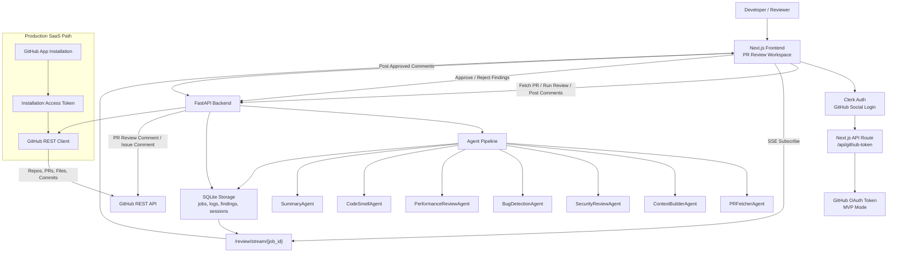

# PRism AI / Agentic Code Review Assistant

PRism AI is an AI-powered Pull Request Review Assistant for Engineering Teams. It connects to GitHub, analyzes pull requests using specialized review agents, streams review progress in real time, produces actionable findings, and posts only human-approved review comments back to GitHub.

The current project is an MVP: Clerk handles app authentication, GitHub OAuth through Clerk provides repository access, and the existing FastAPI backend runs the review pipeline, SSE stream, findings workflow, and GitHub comment posting.

## Project Overview

Developers spend hours reviewing pull requests manually, and important bugs, security issues, code smells, and performance bottlenecks are often missed. PRism AI focuses on one workflow: real-time AI-assisted pull request review.

Core flow:

1. Sign in with GitHub through Clerk.
2. Select a repository and pull request.
3. Fetch PR metadata, changed files, patches, and commits.
4. Run the agentic review pipeline.
5. Watch live SSE agent progress.
6. Approve or reject findings.
7. Post approved comments to GitHub.

## Architecture Flowchart



## Authentication Overview

### MVP Mode: Clerk OAuth

`GITHUB_AUTH_MODE=clerk_oauth`

- Clerk handles user authentication and session management.
- Clerk GitHub social connection provides a GitHub OAuth access token.
- GitHub OAuth App credentials are configured inside Clerk.
- OAuth scopes are configured in Clerk.
- The frontend retrieves the GitHub token through a Next.js server route and forwards it in memory to FastAPI.
- Tokens are not stored in browser localStorage.

This mode is convenient for demos and hackathon-style MVPs, but the `repo` OAuth scope is broad.

### Production Mode: GitHub App

`GITHUB_AUTH_MODE=github_app`

- Clerk remains responsible for app identity and sessions.
- A GitHub App handles repository access.
- Users or organizations install the GitHub App on selected repositories.
- The backend stores `installation_id` per user/org.
- The backend generates short-lived installation access tokens server-side.
- GitHub tokens are never exposed to the frontend.
- Permissions are fine-grained and repository-scoped.

GitHub App mode is intentionally not fully implemented yet. The backend contains a migration-ready auth mode flag and token-provider abstraction. If `github_app` is enabled today, token retrieval raises:

```text
GitHub App mode is planned for production. Configure installation token provider.
```

## Clerk Setup Steps

1. Create a Clerk application.
2. In Clerk, enable the GitHub social connection.
3. Enable `Use custom credentials`.
4. Create a GitHub OAuth App and copy its Client ID and Client Secret into Clerk.
5. Configure scopes in Clerk:

```text
read:user
user:email
repo
workflow
```

6. Copy Clerk environment variables into `frontend/.env.local`:

```text
NEXT_PUBLIC_CLERK_PUBLISHABLE_KEY=pk_...
CLERK_SECRET_KEY=sk_...
NEXT_PUBLIC_API_BASE_URL=http://localhost:8000
```

7. Ensure Clerk can retrieve GitHub OAuth access tokens for the signed-in user.
8. If you change scopes later, users must disconnect/reconnect GitHub or revoke the GitHub OAuth App authorization and sign in again.

## GitHub OAuth App Setup For MVP

1. Open GitHub `Settings`.
2. Go to `Developer settings`.
3. Open `OAuth Apps`.
4. Create a new OAuth App.
5. Set Homepage URL:

```text
http://localhost:3000
```

6. Set Authorization callback URL to the callback URL shown by Clerk for the GitHub social connection.
7. Copy the GitHub OAuth Client ID and Client Secret into Clerk.
8. Configure scopes in Clerk:

```text
read:user
user:email
repo
workflow
```

Scope meaning:

- `read:user`: read GitHub profile.
- `user:email`: read verified GitHub email.
- `repo`: read private repositories and write PR/issue comments.
- `workflow`: access workflow-related operations if needed later.

Warning: `repo` is broad and should be used only for MVP/demo mode. Production SaaS should use a GitHub App with selected repository installation.

## Required GitHub Permissions By Feature

| Feature | MVP OAuth Scope | Production GitHub App Permission |
| --- | --- | --- |
| List repositories | `repo` | Metadata read, Contents read |
| Fetch PRs | `repo` | Pull requests read |
| Read PR diffs/files | `repo` | Pull requests read, Contents read |
| Post PR comments | `repo` | Pull requests write |
| Post issue comments | `repo` | Issues write |
| Read GitHub Actions | `workflow` / `repo` | Actions read |
| Resolve merge conflicts later | `repo` | Contents write, Pull requests write |

## Production SaaS Recommendation

For production, keep Clerk for product identity and sessions, but move GitHub repository access to a GitHub App.

Recommended production architecture:

- Clerk authenticates users.
- GitHub App is installed on selected repositories.
- Backend stores `installation_id` per user/org.
- Backend mints installation access tokens server-side.
- Frontend never receives GitHub tokens.
- Backend requests only required permissions.

Recommended GitHub App permissions:

- Metadata: read
- Contents: read
- Pull requests: read/write
- Issues: read/write
- Actions: read
- Checks: read
- Commit statuses: read

If a future merge conflict resolver is enabled:

- Contents: write
- Pull requests: write

## Security Notes

- Never store raw GitHub tokens in frontend localStorage.
- Never log GitHub tokens.
- Encrypt OAuth tokens if stored server-side.
- Prefer GitHub App installation tokens in production.
- Use least privilege permissions.
- Use selected repository installation for teams.
- Reconnect GitHub after scope changes so old limited tokens are replaced.

## Environment Variables

Root `.env`:

```text
DATABASE_PATH=/data/reviews.db
CORS_ORIGINS=http://localhost:3000,http://127.0.0.1:3000
BACKEND_PORT=8000
FRONTEND_URL=http://localhost:3000
DEMO_MODE=false
GITHUB_AUTH_MODE=clerk_oauth

GITHUB_OAUTH_CLIENT_ID=
GITHUB_OAUTH_CLIENT_SECRET=
GITHUB_OAUTH_CALLBACK_URL=http://localhost:8000/auth/github/callback
SESSION_SECRET_KEY=change-me-use-a-long-random-string
SESSION_COOKIE_NAME=acra_session

NEXT_PUBLIC_API_BASE_URL=http://localhost:8000
NEXT_PUBLIC_CLERK_PUBLISHABLE_KEY=
CLERK_SECRET_KEY=
```

Frontend `.env.local`:

```text
NEXT_PUBLIC_API_BASE_URL=http://localhost:8000
NEXT_PUBLIC_CLERK_PUBLISHABLE_KEY=pk_...
CLERK_SECRET_KEY=sk_...
```

## Local Development Instructions

Backend:

```bash
cd backend
python -m venv .venv
.venv\Scripts\activate
pip install -r requirements.txt
uvicorn app.main:app --reload --host 0.0.0.0 --port 8000
```

Frontend:

```bash
cd frontend
pnpm install
pnpm dev
```

Workflow:

1. Start backend.
2. Start frontend.
3. Sign in with GitHub through Clerk.
4. Open `/dashboard`.
5. Confirm GitHub Permission Status.
6. Open `/repositories`.
7. Select a repository with active PRs.
8. Open the PR Review Workspace.
9. Fetch the PR.
10. Run review.
11. Watch SSE logs, agent graph, toasts, and activity pill.
12. Approve or reject findings.
13. Post approved comments to GitHub.

## API Summary

Auth:

- `GET /auth/github/login` legacy backend OAuth
- `GET /auth/github/callback` legacy backend OAuth
- `GET /auth/github/me`
- `POST /auth/logout`

GitHub:

- `GET /github/permissions/check`
- `GET /github/repositories`
- `GET /github/repositories/{owner}/{repo}/pulls`
- `POST /github/pr/fetch`

Review:

- `POST /review/run`
- `GET /review/stream/{job_id}`
- `GET /review/results/{job_id}`
- `POST /review/finding/status`
- `POST /review/comment/post`

## Troubleshooting

Access denied:

- Clerk GitHub token likely lacks required scopes.
- Ensure `repo` is configured in Clerk for MVP mode.
- Reconnect GitHub after scope changes.

Old token does not have new scopes:

- GitHub tokens issued before a scope update remain limited.
- Revoke the OAuth App in GitHub settings or disconnect/reconnect in Clerk, then sign in again.

Private repo not visible:

- MVP OAuth mode requires `repo`.
- Organization repos may require SSO or OAuth App approval.

Comment posting fails:

- MVP mode needs `repo`.
- Production GitHub App mode needs Pull requests write and Issues write.
- If line-level comments fail, backend falls back to PR-level issue comments.

Rate limit:

- GitHub may rate-limit OAuth tokens.
- Retry after reset, or use GitHub App installation tokens in production.

No scopes detected:

- Some token types may omit `x-oauth-scopes`.
- Use the dashboard GitHub Permission Status card and verify Clerk token configuration.

## Known Limitations

- GitHub App production mode is scaffolded but not implemented.
- Review history currently uses frontend localStorage fallback.
- Repository and PR listing fetch up to 100 items.
- AI review logic is currently rule-based with provider abstraction for future LLM enhancement.
- GitLab integration is not implemented yet.

## Screenshot Placeholders

- Dashboard with GitHub Permission Status
- Repository list highlighting active PR repos
- PR Review Workspace with Monaco diff viewer
- Findings approval/rejection workflow
- Agent graph and real-time timeline
