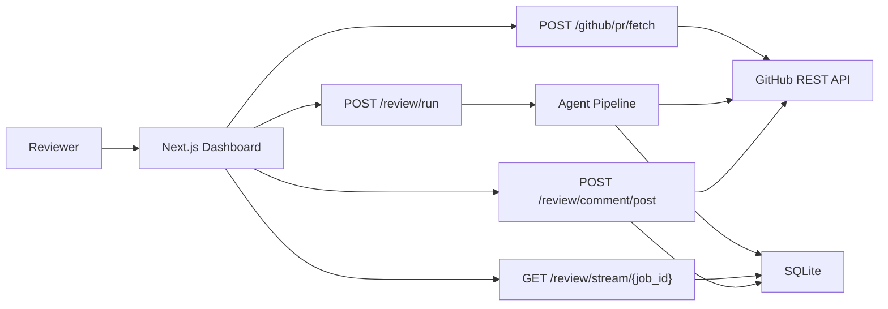

# Agentic Code Review Assistant

Agentic Code Review Assistant is an MVP/prototype for AI-assisted GitHub pull request review. It fetches a real GitHub PR with a user-provided Personal Access Token, analyzes changed patches through a modular review-agent pipeline, streams live execution logs, and lets a human approve comments before posting them back to GitHub.

This project is built for hackathon, portfolio, and recruiter review: it demonstrates full-stack product thinking, GitHub API integration, streaming UX, human-in-the-loop AI review, and a practical path toward production-grade code review automation.

## Features

- Real GitHub PR fetching with Personal Access Token authentication
- Pull request metadata, changed files, patches, and commits from GitHub REST APIs
- Modular backend agent pipeline:
  - `PRFetcherAgent`
  - `ContextBuilderAgent`
  - `SecurityReviewAgent`
  - `BugDetectionAgent`
  - `PerformanceReviewAgent`
  - `CodeSmellAgent`
  - `SummaryAgent`
- Rule-based MVP findings for security risks, bugs, performance issues, and code smells
- Server-Sent Events for live agent logs
- Dark AI-native Next.js dashboard
- Monaco-powered diff viewer
- React Flow pipeline visualization with active/completed/error agent states
- Human approval/rejection before posting
- GitHub line-level PR review comments with fallback to PR-level issue comments
- SQLite storage for jobs, findings, and logs
- Optional demo mode when no token is provided or `DEMO_MODE=true`

## Architecture Overview



The backend never persists the GitHub token. The token is accepted per request from the frontend and used only for the current GitHub API operation.

## Tech Stack

Backend:
- FastAPI
- Python
- httpx
- SQLite
- Server-Sent Events
- GitHub REST API

Frontend:
- Next.js App Router
- TypeScript
- Tailwind CSS
- Monaco Editor
- `@xyflow/react`
- pnpm

AI:
- Provider abstraction for future OpenAI/Gemini/Claude enhancement
- Deterministic rule-based review logic for this MVP

## Folder Structure

```text
.
├── backend/
│   ├── app/
│   │   ├── agents/
│   │   ├── api/
│   │   ├── core/
│   │   ├── models/
│   │   ├── services/
│   │   └── main.py
│   └── requirements.txt
├── frontend/
│   ├── app/
│   ├── components/
│   ├── lib/
│   ├── package.json
│   └── pnpm-lock.yaml
├── .env.example
└── README.md
```

## Prerequisites

- Python 3.11+
- Node.js 20+
- pnpm
- A GitHub Personal Access Token
- A GitHub repository with an open pull request

## GitHub Personal Access Token Setup

For a fine-grained token:

1. Go to GitHub `Settings` -> `Developer settings` -> `Personal access tokens` -> `Fine-grained tokens`.
2. Generate a token for the target repository or organization.
3. Grant repository permissions:
   - Pull requests: read/write
   - Contents: read
   - Metadata: read
   - Issues: read/write, needed for PR-level fallback comments
4. Copy the token and paste it into the frontend form when running the app.

For a classic token:

- Public repos: `public_repo`
- Private repos: `repo`

Do not put the token in `.env`; the MVP intentionally accepts it from the UI per request.

## Environment Variables

Copy `.env.example` to `.env` at the project root if needed.

```text
DATABASE_PATH=/data/reviews.db
CORS_ORIGINS=http://localhost:3000,http://127.0.0.1:3000
BACKEND_PORT=8000
FRONTEND_URL=http://localhost:3000
DEMO_MODE=false

OPENAI_API_KEY=
GEMINI_API_KEY=
ANTHROPIC_API_KEY=

NEXT_PUBLIC_API_BASE_URL=http://localhost:8000
```

`DEMO_MODE=false` makes token-backed requests use the real GitHub API. If `DEMO_MODE=true`, the backend uses built-in demo PR data. If no GitHub token is supplied, the backend also falls back to demo data.

## Backend Setup

```bash
cd backend
python -m venv .venv
.venv\Scripts\activate
pip install -r requirements.txt
```

Run the backend:

```bash
uvicorn app.main:app --reload --host 0.0.0.0 --port 8000
```

Health check:

```bash
curl http://localhost:8000/health
```

## Frontend Setup

```bash
cd frontend
pnpm install
```

Create `frontend/.env.local`:

```text
NEXT_PUBLIC_API_BASE_URL=http://localhost:8000
```

Run the frontend:

```bash
pnpm dev
```

Open [http://localhost:3000](http://localhost:3000).

## Full Usage Flow

1. Start the backend on `http://localhost:8000`.
2. Start the frontend on `http://localhost:3000`.
3. Create a GitHub Personal Access Token with PR read/write and issues write permissions.
4. In the dashboard, enter:
   - GitHub token
   - Repository owner
   - Repository name
   - Pull request number
5. Click `Fetch PR`.
6. Inspect real PR metadata, changed files, and patches.
7. Click `Run Review`.
8. Watch the live agent timeline and React Flow pipeline graph.
9. Inspect generated findings.
10. Approve or reject each suggested comment locally.
11. Click `Post Approved` to publish approved comments to GitHub.
12. Confirm posted status in the UI and on the GitHub PR.

## API Documentation

### `POST /github/pr/fetch`

Fetches real PR metadata, changed files, diffs, and commits from GitHub.

Request:

```json
{
  "github_token": "ghp_or_fine_grained_token",
  "owner": "octocat",
  "repo": "hello-world",
  "pr_number": 1
}
```

Response:

```json
{
  "metadata": {
    "title": "Improve auth validation",
    "author": "developer",
    "state": "open",
    "base_branch": "main",
    "head_branch": "feature/auth-validation",
    "additions": 120,
    "deletions": 32,
    "changed_files": 4,
    "html_url": "https://github.com/octocat/hello-world/pull/1"
  },
  "files": [
    {
      "filename": "src/auth.py",
      "status": "modified",
      "additions": 20,
      "deletions": 5,
      "changes": 25,
      "patch": "@@ ...",
      "raw_url": "https://github.com/...",
      "blob_url": "https://github.com/..."
    }
  ],
  "commits": [],
  "diffs": {
    "src/auth.py": "@@ ..."
  }
}
```

The response also includes `pr_metadata` as a compatibility alias for `metadata`.

### `POST /review/run`

Starts a review job against the real PR data.

Response:

```json
{
  "job_id": "uuid"
}
```

### `GET /review/stream/{job_id}`

Streams Server-Sent Events:

```json
{
  "type": "finding",
  "message": "Finding detected: Unsafe shell execution",
  "agent": "SecurityReviewAgent",
  "metadata": {
    "id": "finding-id"
  }
}
```

### `GET /review/results/{job_id}`

Returns job metadata, findings, summary, and logs.

### `PATCH /review/findings/{finding_id}/approval`

Approves or rejects a finding in storage.

```json
{
  "approved": true
}
```

### `POST /review/comment/post`

Posts an approved finding to GitHub.

```json
{
  "github_token": "ghp_or_fine_grained_token",
  "owner": "octocat",
  "repo": "hello-world",
  "pr_number": 1,
  "comment_id": "finding-id"
}
```

If the finding has a valid `file_path` and `line_number`, the backend first attempts a line-level PR review comment. If that fails, or if no line number exists, it posts a PR-level issue comment.

## Troubleshooting

Invalid token:
- Check that the token was copied correctly.
- Fine-grained tokens must be granted access to the repository.

Repository or PR not found:
- Verify owner, repo, and PR number.
- Private repos require token access.

Rate limit exceeded:
- Wait for GitHub’s rate limit reset.
- Use an authenticated token rather than anonymous/demo mode.

No patch content:
- GitHub may omit patches for binary files, very large files, renamed-only files, or generated files.
- The app will still show the file, but agents can only analyze available patch text.

Posting failed:
- Ensure the token has pull request write permission.
- Ensure issues write permission is available for PR-level fallback comments.
- Some line-level comments fail when the line is outside GitHub’s diff context; the backend falls back to a PR-level comment.

CORS error:
- Confirm `CORS_ORIGINS` includes your frontend URL.
- Default: `http://localhost:3000,http://127.0.0.1:3000`

## Known Limitations

- This is an MVP/prototype, not a production review bot.
- Review rules are deterministic heuristics with optional future AI enhancement.
- GitHub pagination currently fetches up to 100 files and 100 commits.
- No GitHub App auth yet.
- No multi-user auth or encrypted secret storage.
- SQLite is used for local MVP persistence.
- Line mapping is based on added lines in GitHub patch hunks and may fall back to PR-level comments when exact placement is not possible.

## Future Improvements

- GitHub App authentication and installation flow
- Multi-page GitHub pagination for very large PRs
- LLM-powered semantic review with model/provider selection
- Repository context indexing
- Inline prompt tuning and review policy configuration
- Team approval workflows
- Persistent review history per user
- Webhook-triggered automatic reviews
- SARIF or code scanning integration
- Richer test coverage and CI deployment

## Product Thinking

The product is intentionally human-in-the-loop. The assistant accelerates review by finding risky patterns and drafting actionable comments, but the developer remains in control of what gets posted. That keeps the MVP practical for real teams: useful automation without surprise comments appearing on production pull requests.
